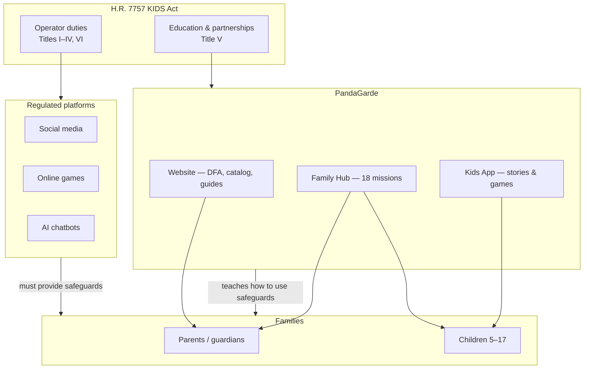

# PandaGarde & H.R. 7757 (KIDS Act) — Policy Alignment Brief

> **Version:** July 2026  
> **Source bill:** [`BILLS-119hr7757eh.pdf`](./BILLS-119hr7757eh.pdf) — *Kids Internet and Digital Safety Act* (KIDS Act), 119th Congress  
> **Bill status (as of July 2026):** Passed House (June 29, 2026); pending Senate  
> **Product scope:** PandaGarde website, Family Hub, Kids App (`dist-kids/`)  
> **Claims in this brief:** Must stay consistent with [`CONTENT_TRUTH.md`](./CONTENT_TRUTH.md)

---

## Executive summary

H.R. 7757 is primarily a **platform regulation** bill. It requires social media, gaming, AI chatbot, and data-collection operators to implement safeguards for minors, parental tools, privacy protections, and disclosures — while also funding research, **public education**, and a **Kids Internet Safety Partnership** to spread age-appropriate best practices.

**PandaGarde is not a covered platform** under the bill's operator duties. It does not host social messaging, operate consumer AI chatbots for minors, sell in-app purchases, or collect behavioral profiles for advertising.

**PandaGarde complements the KIDS Act** by closing the capability gap the bill assumes but does not supply: helping parents and children understand *why* platform safeguards matter and *how* to use them in real family life. The strongest alignment is with **Title V (Research, Education, and Best Practices)** and the bill's stated purpose to *"protect children and teens online, empower parents and strengthen families."*

**Positioning in one line:** The KIDS Act tells platforms what they must build; PandaGarde helps families learn to use those tools — calmly, locally, and without surveillance framing.

---

## Bill overview

| Title | Subject | Primary regulated actors |
|-------|---------|--------------------------|
| **I** | Shielding minors from obscenity | Adult-content sites (age verification) |
| **II** | Online platform safety (KOSA-style) | Social media and similar covered platforms |
| **III** | Social gaming safeguards | Online video game providers |
| **IV** | AI chatbots | Consumer AI chatbot providers |
| **V** | Research, education, partnerships | FTC, HHS, schools, nonprofits, industry |
| **VI** | Kids privacy (COPPA 2.0) | Commercial operators collecting child/teen data |
| **VII** | Enforcement | FTC and state attorneys general |

### Core platform obligations (Titles II–IV) — summary

- **Safeguards for minors:** limit DMs/ephemeral messaging exposure; restrict geolocation sharing; limit compulsive design features; control personalized recommendations; default to most protective settings.
- **Parental tools:** view/manage child privacy settings; restrict purchases; view/limit time on platform; notifications for new DM requests; disable ephemeral messaging for children.
- **AI chatbots (Title IV):** disclose AI nature to minors; provide crisis hotline information; adopt required policies.
- **Gaming (Title III):** parental tools for communication limits and purchase restrictions.

### Education & partnership provisions (Title V) — summary

- **§522 — Online safety education:** FTC-led campaign promoting best practices for educators, platforms, minors, and parents; facilitation of nonprofit and school education efforts.
- **§524 — AWARE Act:** FTC educational resources on safe chatbot use (risks, privacy/data collection, parent support).
- **§526 — Kids Internet Safety Partnership:** age-differentiated, evidence-based best practices; playbook for developers and parental-tool adoption.

---

## PandaGarde's role in the policy ecosystem

### What PandaGarde is in this framing

| Role | Description |
|------|-------------|
| **Family digital resilience system** | Education, ritual, and practice — not enforcement |
| **Title V-aligned nonprofit education resource** | Age-banded missions, parent guides, stories, institutional docs |
| **Privacy-by-design exemplar** | Local-first, data-minimized architecture aligned with COPPA 2.0 spirit |
| **Anti-addictive design model** | Calm UX; no behavioral ads; no manipulative engagement for children |

### What PandaGarde is not

| Misread | Truth (see `CONTENT_TRUTH.md`) |
|---------|-------------------------------|
| Parental control software | Does not remotely manage third-party accounts |
| Child monitoring | No passive tracking of what children do on other apps |
| Platform substitute | Does not host messaging, commerce, or AI chat for minors |
| Compliance audit tool | Educational exposure snapshot, not HIPAA/COPPA certification |

---

## Alignment by bill title

### Title I — Shielding minors from obscenity

| Bill goal | PandaGarde alignment | Notes |
|-----------|---------------------|-------|
| Age verification for adult content | **Not applicable** | PandaGarde is a family education product; no adult-content distribution |
| Protect minors from harmful adult material online | **Indirect — education** | Stories and missions teach red/yellow/green decision-making; stranger-danger scaffolding |

**Family Hub example:** *Traffic Light: Safe or Not?* (ages 5–8) — pause language before sharing personal information.

---

### Title II — Online platform safety & parental tools (§213–§214)

| Bill requirement (platforms) | How PandaGarde supports the goal | Product evidence |
|-----------------------------|----------------------------------|------------------|
| Limit compulsive design features | Models **anti-addictive** child UX | No infinite scroll for children; no gambling-like rewards; calm aesthetic (`PRODUCT_VISION.md` §3; `CHILD_SAFETY_STANDARD.md`) |
| Default protective privacy settings | Teaches families to **find and set** safer defaults | *Privacy Settings Pro* (9–12); *Social Media Privacy Simulator* (13–17) |
| Parental tools to view/manage settings | **Educates** parents to use platform tools | *App Permission Inspector*; service catalog → footprint review |
| Limit messaging with strangers | Family conversation + practice | *Who Can I Talk To Online?* (5–8); *Phishing Patrol* (9–12) |
| Restrict geolocation sharing | Teaches location-sharing risks | *Social Media Privacy Simulator* — audience and location fallout |
| Teen messaging controls | Not a platform; teaches approval/denial concepts | Trusted Team Builder (Kids App); screenshot/messaging missions |

**Critical honesty:** Family Hub does **not** implement §214 parental tools on Instagram, Roblox, Snapchat, or other third-party services. Copy must say families **learn to use** platform controls — not that PandaGarde provides them.

---

### Title III — Social gaming safeguards

| Bill requirement (game platforms) | How PandaGarde supports the goal | Product evidence |
|----------------------------------|----------------------------------|------------------|
| Parental communication limits | Education on in-game chat risks | *Who Can I Talk To Online?*; catalog entries for Roblox, Fortnite, etc. |
| Purchase restrictions | Teaches scrutiny at sign-up | *Pack Your Digital Backpack* — what forms ask for |
| Gaming-specific privacy | Self-reported catalog + footprint | Service catalog includes major games; footprint scores drive conversation |

---

### Title IV — AI chatbots

| Bill requirement (chatbot operators) | How PandaGarde supports the goal | Product evidence |
|---------------------------------------|----------------------------------|------------------|
| Disclose AI is not human | **Education** on AI nature and limits | Echo character arc; *AI & Your Privacy* mission (13–17) |
| Crisis hotline disclosure | **Gap — recommended enhancement** | See §Recommended enhancements below |
| Safe chatbot policies | PandaGarde does not operate child-facing AI chat | `AI_SAFETY_POLICY.md`; no unmoderated AI chat access (`CHILD_SAFETY_STANDARD.md`) |
| AWARE Act parent/educator resources (§524) | Strong thematic alignment | Teen mission covers prompt privacy, training data, settings review |

**§524 topic mapping:**

| AWARE Act resource topic | PandaGarde surface |
|--------------------------|-------------------|
| Risks and benefits of chatbot use | *AI & Your Privacy* mission; Echo stories |
| Privacy and data collection practices | DFA journey; *Digital Footprint Trail*; catalog |
| Best practices for parents | `FAMILYHUB_MISSIONS_PARENT_GUIDE.md`; parent guides on website |

---

### Title V — Research, education, and best practices *(strongest fit)*

| Bill provision | PandaGarde alignment | Evidence |
|----------------|---------------------|----------|
| §522 — Public awareness and educational campaign | **Direct** — nonprofit education for parents, educators, minors | 18 age-matched missions; stories; DFA journey; parent one-pager |
| §522 — Facilitate nonprofit/school education access | **Direct** — institutional layer (aspirational) + pilot docs | `PRODUCT_VISION.md` Layer 3; curriculum alignment in SDLC |
| §522 — "Online safety" definition: effective use of safeguards & parental controls | **Direct** — missions end with one real settings/action step | Every mission: intro → activity → family talk → **do this after** |
| §524 — Safe chatbot use resources | **Strong** — teen AI mission + story canon | `ageBasedActivities.ts`; Episode 9 *The Echo Chamber* |
| §526 — Age-differentiated best practices | **Strong** — three age bands (5–8, 9–12, 13–17) | `hubAgeBands.ts`, `ageBasedActivities.ts` |
| §526 — Partnership stakeholder (nonprofit, academic) | **Positioning opportunity** | ERMITS Advisory; CISSP/CISA governance suite |

**Bill definition of "online safety" (§522) — PandaGarde coverage:**

| Statutory element | PandaGarde support |
|-------------------|-------------------|
| (A) Protect from cybercrime, narcotics, gambling, alcohol, adult content | Phishing, stranger messaging, red/yellow/green sorting missions |
| (B) Prevent compulsive behavior and adverse health impacts | Anti-addictive design doctrine; no streak anxiety in child layer |
| (C) Facilitate effective use of safeguards and parental controls | Settings missions; catalog; parent-guided Hub; DFA capability path |

---

### Title VI — COPPA 2.0 (kids privacy)

| COPPA 2.0 direction | PandaGarde alignment | Evidence |
|--------------------|---------------------|----------|
| Expand protections to teens | Teen band missions (13–17); no teen behavioral profiling | `CONTENT_TRUTH.md` §3 |
| Limit targeted advertising to children/teens | **Zero behavioral advertising** | `PRIVACY_ENGINEERING_STANDARD.md`; Kids App has no analytics |
| Data minimization | **Local-first**; name + age only for children in Hub | `hubCopy.ts`; `CONTENT_TRUTH.md` §2 |
| Deletion rights | Device-local data; user can reset | Kids App grown-ups corner; local storage model |
| Operator status | Educational nonprofit positioning; not a data broker or ad platform | Frontend-only PWA; no production backend for family sync |

**Architecture note:** If commercial operator status were ever asserted, PandaGarde's current local-first, no-analytics Kids bundle and data-minimization standards are aligned with the bill's privacy direction. Legal classification is outside this engineering brief.

---

### Title VII — Enforcement

PandaGarde is not an enforcement target for platform duties. Alignment is **educational and architectural**, not regulatory compliance as a covered operator.

---

## Mission-to-policy mapping (Family Hub)

Quick reference for grants, pilots, and policy conversations. Full catalog: [`FAMILYHUB_MISSIONS_PARENT_GUIDE.md`](./FAMILYHUB_MISSIONS_PARENT_GUIDE.md).

| Age band | Mission | KIDS Act theme supported |
|----------|---------|-------------------------|
| 5–8 | Traffic Light: Safe or Not? | Harm avoidance; adult-content/social engineering precursors |
| 5–8 | Who Can I Talk To Online? | Messaging safety; stranger controls (§214 education) |
| 5–8 | Secret Keeper Club | Account security; password as "house key" |
| 9–12 | Privacy Settings Pro | Parental-tool literacy (§214(B)) |
| 9–12 | App Permission Inspector | Permissions; geolocation/contacts/mic (§214(E) education) |
| 9–12 | Phishing Patrol | Financial/deceptive harm (§213(4)) |
| 9–12 | Screenshot Safety Challenge | Social harm; bullying prevention |
| 13–17 | Social Media Privacy Simulator | Messaging, audience, location (§214) |
| 13–17 | Data Broker Discovery | Personal information disclosure (Title VI) |
| 13–17 | Privacy Rights Challenge | Consent and deletion literacy (COPPA 2.0) |
| 13–17 | AI & Your Privacy | AWARE Act / Title IV education |

---

## Four-surface contribution

| Surface | KIDS Act contribution |
|---------|----------------------|
| **Website** | DFA journey (catalog → footprint); safety alerts from self-reported services; parent guides; privacy assessment |
| **Family Hub** | 18 structured missions with family ritual and real-world action steps |
| **Kids App** | Calm immersive learning; Trusted Team Builder; no analytics; parental gate on grown-ups view |
| **Institutional** *(aspirational)* | Evidence base, pilot outcomes, curriculum alignment for §526 partnership participation |

---

## Approved positioning language

**Use (copy-paste safe for grants/pilots):**

- PandaGarde is a **family digital resilience** system that helps parents and children practice online safety, privacy settings, and responsible technology use — complementing platform safeguards required under federal child-safety legislation.
- Family Hub provides **18 age-matched privacy missions** (ages 5–17) with parent-guided conversation and one concrete action per mission — aligned with the KIDS Act's emphasis on **empowering parents and strengthening families**.
- PandaGarde teaches families to **use** parental controls and privacy settings on the apps they already use; it is **not** a monitoring tool or a substitute for platform-provided safeguards.
- The Kids App and Family Hub are **local-first** and **privacy-by-design** — no behavioral advertising, no child social network, no unmoderated AI chat.

**Avoid (see `CONTENT_TRUTH.md` §8):**

- Implying PandaGarde monitors children's online activity
- Claiming PandaGarde provides parental controls on third-party platforms
- "Real-time alerts" about child behavior
- HIPAA/COPPA certification claims

---

## Gaps and recommended enhancements

To strengthen implementation-partner positioning for Title V and §526:

| Priority | Enhancement | Bill hook | Effort |
|----------|-------------|-----------|--------|
| **High** | **Platform settings deep-links appendix** — per-mission "where to find this on Instagram/Roblox/Snapchat" parent card | §214 parental tools; §522(C) effective use of safeguards | Content + printable |
| **High** | **AWARE parent one-pager** — chatbot risks, data collection, family rules (printable PDF) | §524 | Content |
| **Medium** | **Crisis resources block** on teen AI content — 988 / Crisis Text Line with clear "PandaGarde is not a chatbot" framing | Title IV spirit | UI copy on AI mission + teen stories |
| **Medium** | **Pilot evidence package** — pre/post parent confidence, mission completion, settings actions taken | §526 evidence-based practices | Research design |
| **Medium** | **Educator/district brief** — age-banded mission map to ISTE/digital citizenship standards | §522 schools; §526 stakeholders | Doc |
| **Lower** | **Unified parent progress bridge** — DFA + Hub + Kids App in one view | §214 parental awareness | Engineering (`PRODUCT_VISION.md` Phase 1.5) |

---

## Grant and pilot narrative (template)

**Problem (bill-aligned):** Federal child-safety legislation increasingly requires platforms to provide safeguards and parental tools — but **families lack the literacy and ritual** to use those tools effectively. Title V explicitly calls for education and nonprofit partnerships to close that gap.

**Intervention:** PandaGarde delivers age-differentiated, calm, parent-guided privacy missions across website, Family Hub, and Kids App — teaching settings review, permission hygiene, messaging safety, and AI literacy without surveillance framing.

**Differentiation:** Unlike parental-control vendors (enforcement without education) and unlike passive content libraries (information without action), PandaGarde's mission model is **practice → family agreement → one real fix**.

**Outcome metrics (pilot-ready):**

- Mission completion rate by age band
- Parent self-reported confidence using platform privacy settings (pre/post)
- Documented family actions (settings changed, permissions revoked, 2FA enabled)
- Child certificate / badge completion (engagement without compulsive mechanics)

**Policy fit:** Complements H.R. 7757 operator duties; directly supports Title V education and Kids Internet Safety Partnership goals.

---

## Related documents

| Document | Role |
|----------|------|
| [`CONTENT_TRUTH.md`](./CONTENT_TRUTH.md) | Shipped behavior — all outward claims must match |
| [`PRODUCT_VISION.md`](./PRODUCT_VISION.md) | Product north star, four-surface architecture, condensed KIDS Act mapping (§12) |
| [`FAMILYHUB_MISSIONS_PARENT_GUIDE.md`](./FAMILYHUB_MISSIONS_PARENT_GUIDE.md) | Mission catalog for parents |
| [`sdlc/CHILD_SAFETY_STANDARD.md`](./sdlc/CHILD_SAFETY_STANDARD.md) | Child UX prohibitions and required controls |
| [`sdlc/PRIVACY_ENGINEERING_STANDARD.md`](./sdlc/PRIVACY_ENGINEERING_STANDARD.md) | Data minimization and no behavioral ads |
| [`sdlc/VISION.md`](./sdlc/VISION.md) | Family Hub authoritative identity |
| [`BILLS-119hr7757eh.pdf`](./BILLS-119hr7757eh.pdf) | Source legislation |

---

## Disclaimer

This brief is an **engineering and product alignment analysis**, not legal advice. Bill text, passage status, and regulatory interpretation may change. PandaGarde's regulatory classification (nonprofit exemption, operator status, etc.) requires counsel. All user-facing claims must be verified against `CONTENT_TRUTH.md` and `npm run check:content-truth` before release.

---

*PandaGarde · ERMITS Advisory · pandagarde.com*
